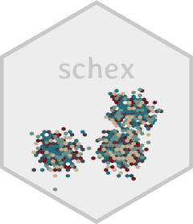
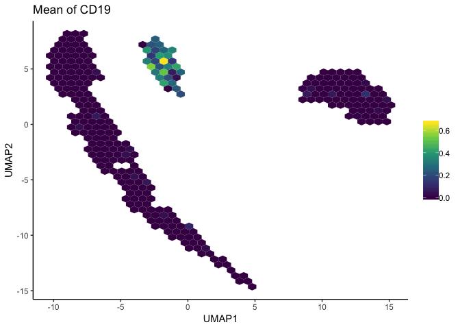
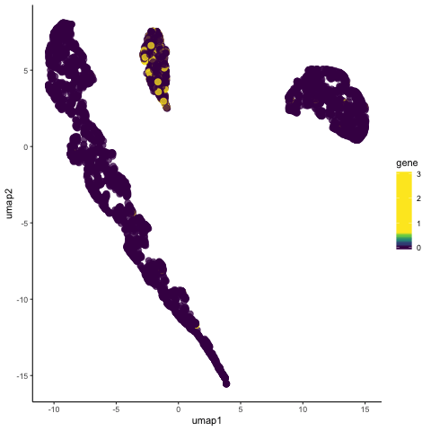

<!-- README.md is generated from README.Rmd. Please edit that file -->

```{r, include = FALSE}
knitr::opts_chunk$set(
  collapse = TRUE,
  comment = "#>",
  fig.path = "man/figures/README-",
  out.width = "100%"
)
```
# schex

<!-- badges: start -->
  [](https://travis-ci.org/SaskiaFreytag/schex)
    [](https://codecov.io/gh/SaskiaFreytag/schex?branch=master)
<!-- badges: end -->


The goal of schex is to provide easy plotting of hexagon cell representations
of single cell data stored in `SingleCellExperiment` or `Seurat` objects.


## Installation

You can install the development version of schex with:

``` r
# install.packages("devtools")
devtools::install_github("SaskiaFreytag/schex")
```

Note that you may need to install several bioconductor packages if 
you haven't done so manually.

``` r
# install.packages("BiocManager")
BiocManager::install(version='devel')
BiocManager::install("SingleCellExperiment")
```

## Why you need schex?

Did you know that order in which points are plotted depends on their location
in the data frame? 
For example when plotting the expression of CD19, a B-cell maker, you may 
get the following three plots depending on how you order your observations.

{width=49%}
{width=49%}
{width=49%}

Using the first plot you would not decide to call the central cluster a B-cell 
population. Using the second plot you would probably decide to call the same 
cluster a B-cell population. Using the last plot you might be undecided.

## The solution

Instead of plotting points on top of each other, schex summarizes points into 
hexagon cells. Hence avoiding confusion due to observation order.

{width=49%}

## How schex works?

Points in the same neighbourhood are summarized using one of many different
summary statistics. The animation below shows how this works when using
the mean to summarize the expression of CD19.



