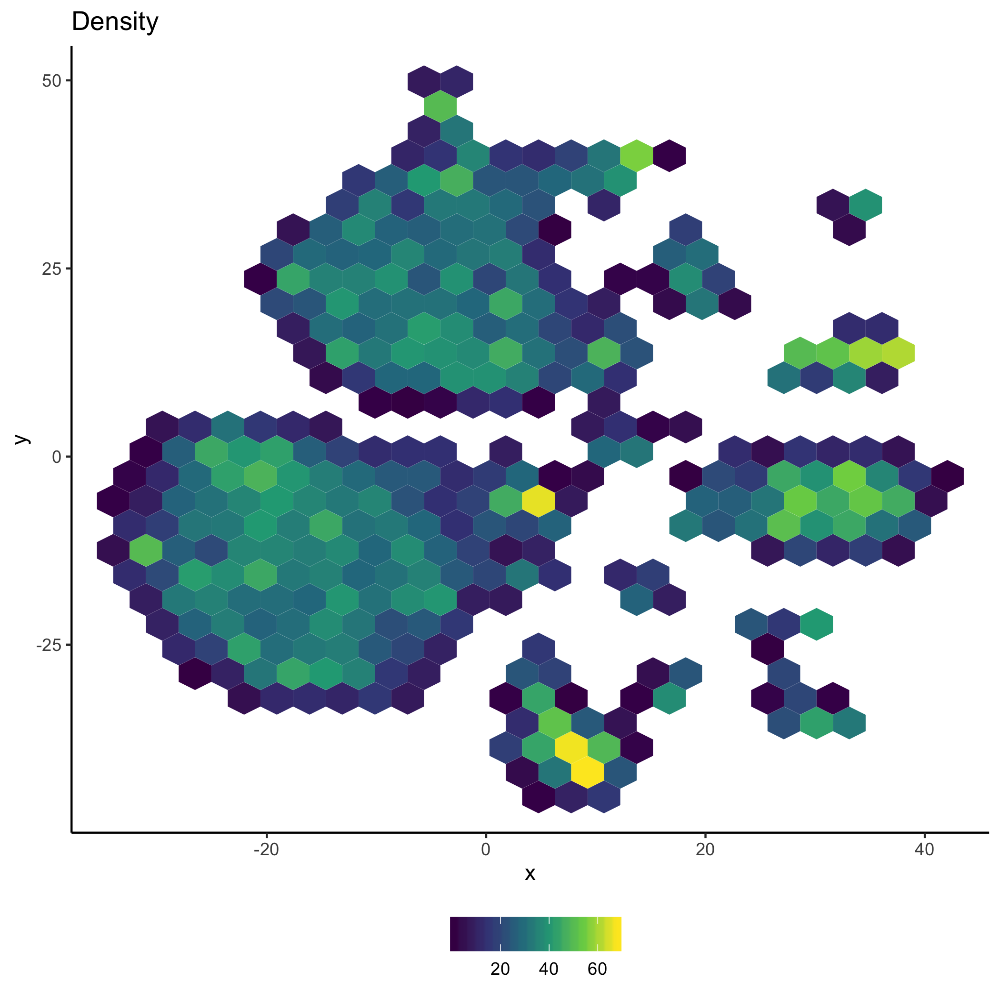
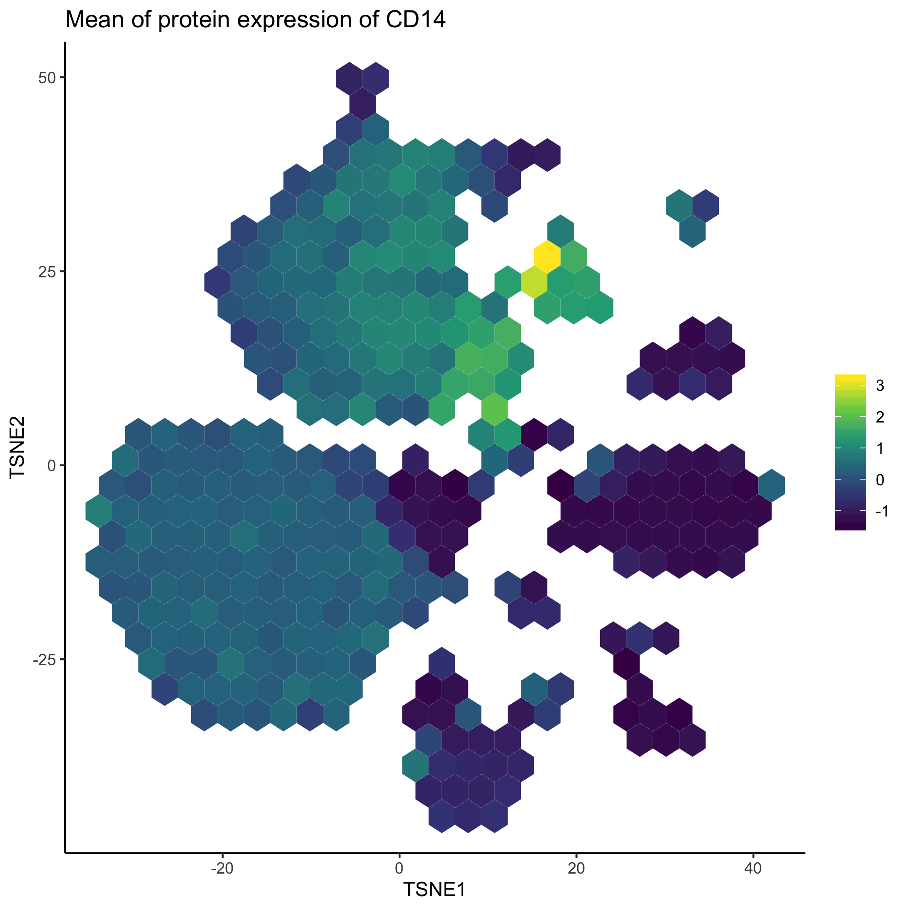
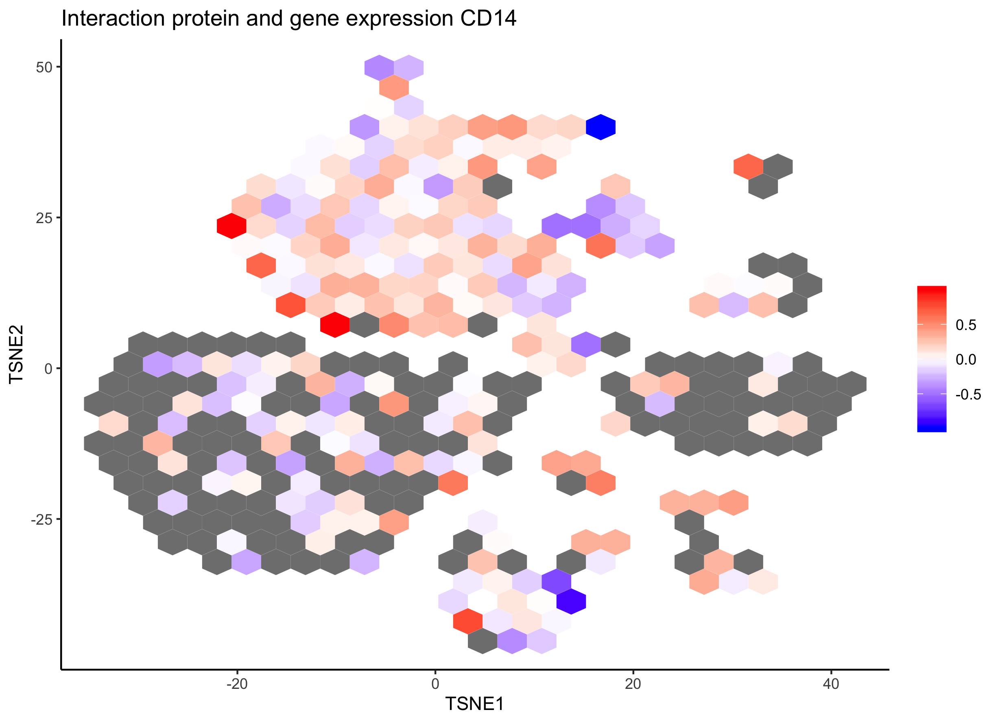
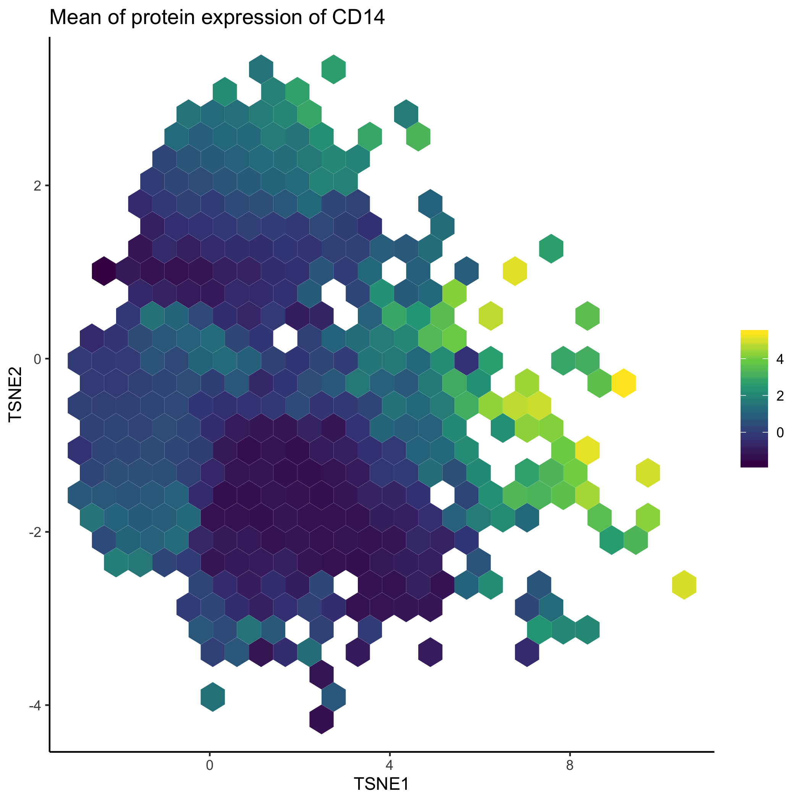

```{r, include = FALSE}
knitr::opts_chunk$set(
    collapse = TRUE,
    comment = "#>"
)
library(ggplot2)
theme_set(theme_classic())
```

This vignette demonstrates features that allow users to visualize and explore multi-modal data with schex. Due to current data availablility, we will demonstrate schex's capabilities for Seurat object only. To get started with multi-modal data with SingleCellExperiment objects refer to [this](https://bioconductor.org/packages/devel/bioc/vignettes/SingleCellExperiment/inst/doc/intro.html#5_adding_alternative_feature_sets).

## Load libraries

```{r setup, message=FALSE, eval=FALSE}
library(Seurat)
library(schex)
```

## Setup single cell data

Here, we analyze a dataset of 8,617 cord blood mononuclear cells (CBMCs), produced with CITE-seq, where we simultaneously measure the single cell transcriptomes alongside the expression of 11 surface proteins, whose levels are quantified with DNA-barcoded antibodies. First, we load in two count matrices : one for the RNA measurements, and one for the antibody-derived tags (ADT). You can download the ADT file [here](ftp://ftp.ncbi.nlm.nih.gov/geo/series/GSE100nnn/GSE100866/suppl/GSE100866_CBMC_8K_13AB_10X-ADT_umi.csv.gz) and the RNA file [here](ftp://ftp.ncbi.nlm.nih.gov/geo/series/GSE100nnn/GSE100866/suppl/GSE100866_CBMC_8K_13AB_10X-RNA_umi.csv.gz).

Note that this dataset also contains \~5% of mouse cells, which we can use as negative controls for the protein measurements. For this reason, the gene expression matrix has HUMAN\_ or MOUSE\_ appended to the beginning of each gene. We are only going to work with the top 100 most highly expressed mouse genes, and remove the 'HUMAN\_' from the CITE-seq prefix.

```{r load, eval=FALSE}
cbmc.rna <- as.sparse(read.csv(file = 
    "../new functions/data/GSE100866_CBMC_8K_13AB_10X-RNA_umi.csv.gz", 
    sep = ",", header = TRUE, row.names = 1))

cbmc.rna <- CollapseSpeciesExpressionMatrix(cbmc.rna)

cbmc.adt <- as.sparse(read.csv(file = 
    "../new functions/data/GSE100866_CBMC_8K_13AB_10X-ADT_umi.csv.gz", 
    sep = ",", header = TRUE, row.names = 1))

cbmc.adt <- cbmc.adt[setdiff(rownames(x = cbmc.adt), 
      c("CCR5", "CCR7", "CD10")), ]
```

In the next few sections, I will follow the preprocessing steps outlined in the [Seurat vignette regarding multi-modal data](https://satijalab.org/seurat/v3.1/multimodal_vignette.html). Briefly, I will perform some simple quality control steps including normalization on the gene expression data. I will then calculate various dimension reductions. After this, I will add the the protein expression levels to the Seurat object. Subsequently, these will be normalized.

## Preprocessing

### Preprocessing gene expression data

I will apply a standard log-normalization and standard scaling.

```{r preprocess-gene, eval=FALSE}
cbmc <- CreateSeuratObject(counts = cbmc.rna)

cbmc <- NormalizeData(cbmc)
cbmc <- FindVariableFeatures(cbmc)
cbmc <- ScaleData(cbmc)
```

I will calculate both the PCA and t-SNE dimension reduction.

```{r cluster-gene, eval=FALSE}
cbmc <- RunPCA(cbmc, verbose = FALSE)
cbmc <- RunTSNE(cbmc, dims = 1:25, method = "FIt-SNE")
```

### Preprocessing protein expression data

After adding the protein expression data to the Seurat object. Then, I will use a centered log-ration normalization, computed independently for each feature.

```{r preprocess-protein, eval=FALSE}
cbmc[["ADT"]] <- CreateAssayObject(counts = cbmc.adt)

cbmc <- NormalizeData(cbmc, assay = "ADT", normalization.method = "CLR")
cbmc <- ScaleData(cbmc, assay = "ADT")
```

## Plotting multi-modal single cell data

One popular visualization with multi-modal data is to plot the protein expression on top of the dimension reduction computed from the gene expression. This can be easily achieved with schex. However, first I need to calculate the hexagon cell representation for each cell for a specified dimension reduction representation.

#### Calculate hexagon cell representation

Here, I decided to use the t-SNE dimension reduction for schex plotting. I decide to use `nbins=25` which specifies that I divide my x range into 30 bins. Note that this might be a parameter that you want to play around with depending on the number of cells/nuclei in your dataset. Generally, for more cells/nuclei, `nbins` should be increased.

```{r calc-hexbin, eval=FALSE}
cbmc <- make_hexbin(cbmc, nbins = 25, 
    dimension_reduction = "tsne", use_dims=c(1,2))
```

#### Plot number of cells/nuclei in each hexagon cell

To check that I chose a sensible binning strategy. I will plot how many cells are in each hexagon cell.

```{r plot-density, fig.height=7, fig.width=7, eval=FALSE}
plot_hexbin_density(cbmc)
```

{width="100%"} \#### Plot protein expression in hexagon cell representation of gene expression data

Finally, I will visualize the gene expression of the CD14 protein in the hexagon cell representation.

```{r plot-feature, fig.height=7, fig.width=7, eval=FALSE}
plot_hexbin_feature(cbmc, mod="ADT", type="scale.data", feature="CD14", 
    action="mean", xlab="TSNE1", ylab="TSNE2", 
    title=paste0("Mean of protein expression of CD14"))
```

{width="100%"}

### Plot interaction between protein and gene expression in hexagon cell representation

Because each hexagon contains multiple cells, I can calculate interactions between protein expression and gene expression. For example, I can check whether CD14 gene expression correlates with its protein expression. Note that because of the sparsness of the data, the correlation cannot be calculated for many of the hexagons. However, for the cluster with high CD14 expression, there does not seem to be a strong realtionship between protein expression and gene expression for most cells.

```{r plot-interact, fig.height=7, fig.width=7, message=FALSE, warning=FALSE, eval=FALSE}
plot_hexbin_interact(cbmc, type=c("scale.data", "scale.data"),
    mod=c("RNA", "ADT"), feature=c("CD14", "CD14"), interact="corr_spearman",
    ylab="TSNE2", xlab="TSNE1", 
    title="Interaction protein and gene expression CD14") +
    scale_fill_gradient2(midpoint=0, low="blue", mid="white",
                     high="red", space ="Lab")
```

{width="100%"}

### Plotting protein expression in hexagon cell representation of protein expression data

It can also be beneficial to use the dimension reduction calculated on the protein expression data and visualize protein or expression data. To this end, I will have to recalculate the hexbin representation with regard to the protein expression data.

```{r protein-pca, message=FALSE, warning=FALSE, eval=FALSE}
DefaultAssay(cbmc) <- "ADT"
cbmc <- RunPCA(cbmc, features = rownames(cbmc), reduction.name = "pca_adt", 
    reduction.key = "pca_adt_", verbose = FALSE)
cbmc <- make_hexbin(cbmc, nbins = 25, 
    dimension_reduction = "pca_adt", use_dims=c(1,2))
```

Now, I will visualize CD14 protein expression in its respective dimension reduction space.

```{r plot-feature-a, fig.height=7, fig.width=7, eval=FALSE}
plot_hexbin_feature(cbmc, mod="ADT", type="scale.data", feature="CD14", 
    action="mean", xlab="TSNE1", ylab="TSNE2", 
    title=paste0("Mean of protein expression of CD14"))
```

{width="100%"}
