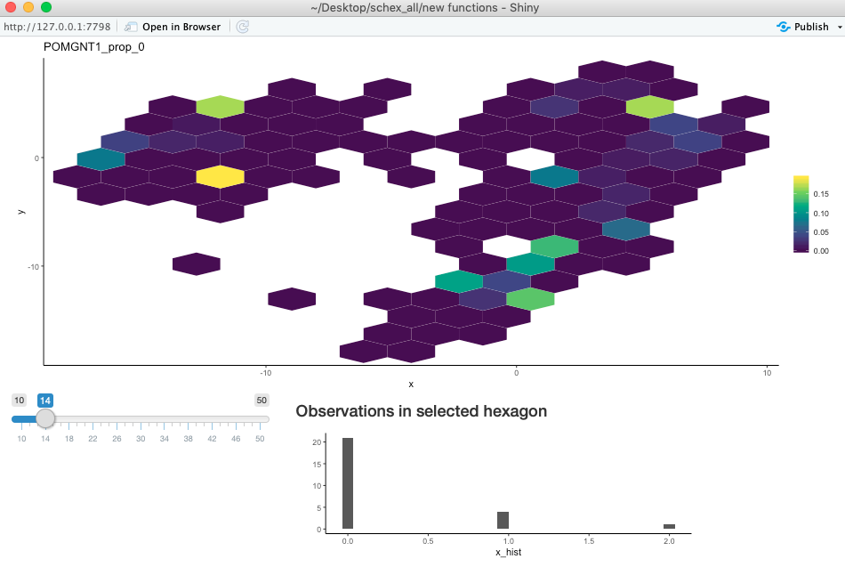
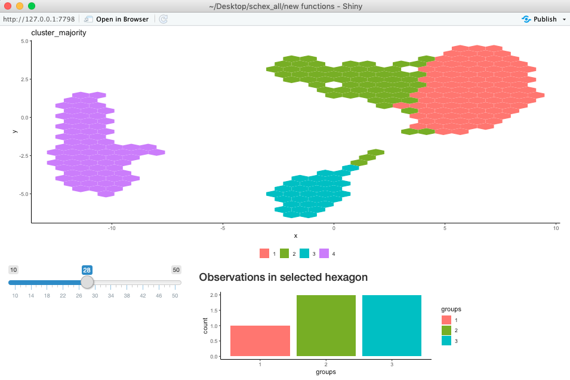

```{r, include = FALSE}
knitr::opts_chunk$set(
    collapse = TRUE,
    comment = "#>"
)
```

```{r setup, eval=FALSE}
library(igraph)
library(schex)
library(TENxPBMCData)
library(scater)
library(scran)
library(ggrepel)
```

The resolution of the schex plots is determined by the number of bins the range
of the first component of the chosen dimension reduction is partitioned into.
Different values of this parameter can result in different looking plots, 
especially for small datasets. In order to investigate this effect further,
schex offers a interactive plot. I will demonstrate the uuse of this plot 
using the Peripheral Blood Mononuclear Cells (PBMC) freely available from 
10x Genomics. I will do minimal processing. 

## Setup single cell data

The data is handly availabe in the [`TENxPBMCData` package](http://bioconductor.org/packages/release/data/experiment/html/TENxPBMCData.html).

```{r load, eval=FALSE}
tenx_pbmc3k <- TENxPBMCData(dataset = "pbmc3k")

rownames(tenx_pbmc3k) <- uniquifyFeatureNames(rowData(tenx_pbmc3k)$ENSEMBL_ID, 
    rowData(tenx_pbmc3k)$Symbol_TENx)
```

### Filtering

I filter cells with high mitochondrial content as well as cells with low
library size or feature count.

```{r filter-cells, eval=FALSE}
rowData(tenx_pbmc3k)$Mito <- grepl("^MT-", rownames(tenx_pbmc3k))
colData(tenx_pbmc3k) <- cbind(colData(tenx_pbmc3k), 
    perCellQCMetrics(tenx_pbmc3k, 
        subsets=list(Mt=rowData(tenx_pbmc3k)$Mito)))
rowData(tenx_pbmc3k) <- cbind(rowData(tenx_pbmc3k), 
    perFeatureQCMetrics(tenx_pbmc3k))

tenx_pbmc3k <- tenx_pbmc3k[, !colData(tenx_pbmc3k)$subsets_Mt_percent > 50]

libsize_drop <- isOutlier(tenx_pbmc3k$total,
      nmads = 3,type = "lower", log = TRUE)
feature_drop <- isOutlier(tenx_pbmc3k$detected,
    nmads = 3, type = "lower", log = TRUE)

tenx_pbmc3k <- tenx_pbmc3k[, !(libsize_drop | feature_drop)]
```

I filter any genes that have 0 count for all cells.

```{r filter-genes, eval=FALSE}
rm_ind <- calculateAverage(tenx_pbmc3k)<0
tenx_pbmc3k <- tenx_pbmc3k[!rm_ind,]
```

### Normalization

I normalize the data by using a simple library size normalization.

```{r norm, message=FALSE, warning=FALSE, eval=FALSE}
tenx_pbmc3k <- scater::logNormCounts(tenx_pbmc3k)
```

### Dimension reduction

I use both Principal Components Analysis (PCA) and Uniform Manifold 
Approximation and Projection (UMAP) in order to obtain reduced dimension 
representations of the data. Since there is a random component in the UMAP, I
will also set a seed.

```{r dim-red, message=FALSE, warning=FALSE, eval=FALSE}
tenx_pbmc3k <- runPCA(tenx_pbmc3k)
set.seed(10)
tenx_pbmc3k <- runUMAP(tenx_pbmc3k, dimred = "PCA", spread = 1, 
    min_dist = 0.4)
```

### Clustering

I will cluster the data on the PCA representation using Louvain clustering.

```{r cluster, eval=FALSE}
snn_gr <- buildSNNGraph(tenx_pbmc3k, use.dimred = "PCA", k = 50)
clusters <- cluster_louvain(snn_gr)
tenx_pbmc3k$cluster <- factor(clusters$membership)
```

## Interactively exploring resolution in schex plots 

### Exploring changes to density 

To see the effect of the resolution parameter on the density, schex offers a
handy interactive function. The interactive function opens a shiny application
where you can change the resolution parameter using a slider. 
To find an appropriate value for the resolution
parameter find a point where the appearance of the plot is stable.

```{r, eval=FALSE}
plot_hexbin_density_shiny(tenx_pbmc3k, 10, 50, dimension_reduction = "UMAP")
```    

### Exploring changes to feature plot

The effect of the resolution parameter on plots of feature expression can also
be investigated using an interactive function. In particular, not only can
the resolution be directly changed, but also each hexagon can be interrogated. 
The user can click on a hexagon and will be shown a histogram of the data
represented by the histogram.

```{r, eval=FALSE}
plot_hexbin_feature_shiny(tenx_pbmc3k, type="counts", feature="POMGNT1", 
    action="prop_0", min_nbins=10, max_nbins=50, dimension_reduction="UMAP",
    mod="RNA")
```

{width=60%}

### Exploring changes to meta plot

The effect of the resolution parameter on plots of meta data can also
be investigated using an interactive function. In particular, not only can
the resolution be directly changed, but also each hexagon can be interrogated. 
The user can click on a hexagon and will be shown a histogram or bar plot of the 
data represented by the histogram.

```{r, eval=FALSE}
plot_hexbin_meta_shiny(tenx_pbmc3k, col="cluster",
    action="majority", min_nbins=10, max_nbins=50, dimension_reduction="UMAP")
```

{width=60%}
