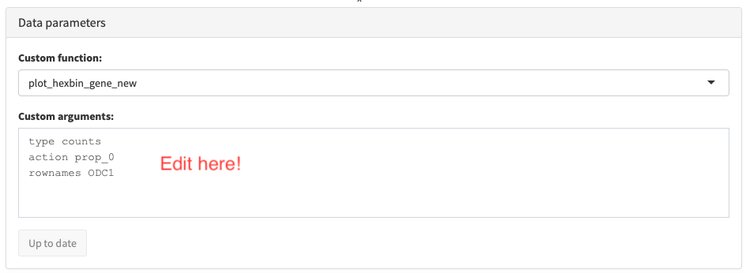

```{r, include = FALSE}
knitr::opts_chunk$set(
    collapse = TRUE,
    comment = "#>"
)
```

```{r setup, eval=FALSE}
library(shiny)
library(Seurat)
library(ggrepel)
library(shinydashboard)
library(schex)
library(iSEE)
```

## Setting up for a simple shiny dashboard or iSEE instance

Interrogating your data is often easier when being able to do it interactively
on the fly. With the packages `shiny` and `shinydashboard` it is simple to 
create an interactive dashboard for exactly that purpose. Here we will work with 
the single cell data from peripheral mononuclear cells (PBMCs) stored in the 
`pbmc_small` `Seurat` object (which can be found in the `Seurat` package.) 

First we create a the hexagon cell representation and also make a data frame to
store the position of cluster labels.

```{r, eval=FALSE}
pbmc_small <- make_hexbin(pbmc_small, nbins = 10, dimension_reduction = "PCA")
df_label <- make_hexbin_label(pbmc_small, "RNA_snn_res.0.8")
```    

## The shiny dashboard

Now it is pretty easy to create a simple shiny dashboard which allows you
to visualize the gene expression of every gene in the dataset. After 
running the function, the application is initialized by running `app`.

```{r, eval=FALSE}
app <- shinyApp( 
    server= function(input, output){
  
        output$all_genes <- renderUI({
            selectInput(inputId = "gene", label = "Gene", 
                choices = rownames(pbmc_small))
        })
    
        output$plot1 <- renderPlot({ 
            plot_hexbin_meta(pbmc_small, "RNA_snn_res.0.8", action="majority",
                title="Clusters") + guides(fill=FALSE) +
                ggrepel::geom_label_repel(data=df_label, 
                aes(x=x, y=y, label=label), colour="black",
                label.size=NA, fill=NA)
        
        })
      
        output$plot2 <- renderPlot({ 
            plot_hexbin_feature(pbmc_small, type=input$type, feature=input$gene, 
                action=input$action, title=input$gene) 
        })
    
    
    },
    ui= dashboardPage(skin = "purple",
        dashboardHeader(),
        dashboardSidebar(
            uiOutput("all_genes"),
            radioButtons("type", "Type of expression:",
                c("Raw" = "counts",
                     "Normalized" = "data")),
            radioButtons("action", "Summarize using:",
                c("Proportion not 0" = "prop_0",
                      "Mean" = "mean",
                      "Median" = "median"))
      
        ),
        dashboardBody(
            fluidRow(
                  box(plotOutput("plot1", width = 450, height=400), width=6),
                  box(plotOutput("plot2", width = 500, height=400), width=6))
            )
        )
)
```

### Customizing your own shiny dashboard

If you want to add functionality to your shiny dashboard, I would suggest the 
following resources:

*[shiny](https://shiny.rstudio.com/)

*[shinydashboard](https://rstudio.github.io/shinydashboard/)

## An iSEE instance

The [iSEE package](https://bioconductor.org/packages/release/bioc/html/iSEE.html) 
provides another way of generating an interactive session in order to 
interrogate your data in a web browser. However in order to use schex plots you
need to provide a custom function that works on an object of the 
`SummerizedExperiment` class. The `SingleCellExperiment` class inherits all 
features from this class and can thus be used.

```{r convert, eval=FALSE}
pbmc_small <- as.SingleCellExperiment(pbmc_small)
pbmc_small <- make_hexbin(pbmc_small, nbins=10, dimension_reduction = "PCA")
```

```{r, eval=FALSE}
plot_hexbin_gene_new <- function(sce, rows=NULL, rownames=character(0), 
    columns=NULL, type="logcounts", action="prop_0"){

      plot_hexbin_feature(sce, type=type, feature=rownames, action=action)
}
```

Simply now tell iSEE about schex, using the following. After 
running the functions, the application is initialized by running `app`.

```{r, eval=FALSE}
schex_plot_gene <- customDataPlotDefaults(pbmc_small, 1)
schex_plot_gene$Function <- "plot_hexbin_gene_new"
schex_plot_gene$Arguments <- "type counts\naction prop_0\nrownames ODC1"
schex_plot_gene$ColumnSource <- "NULL"
schex_plot_gene$RowSource <- "NULL"
schex_plot_gene$DataBoxOpen <- TRUE

  
app <- iSEE(
    pbmc_small, 
    customDataArgs=schex_plot_gene, 
    initialPanels=DataFrame(
        Name=c("Custom data plot 1"),
        Width=c(12)),
    customDataFun=list(plot_hexbin_gene_new=plot_hexbin_gene_new)
    )
```

Unfortunately in the iSEE application plots cannot be changed to display 
different genes as conveniently as with `shinydashboards`. If you want
to diplay a different gene you will need to edit the following box:

{width=60%}

For example by typing 

```
type counts
action prop_0
rownames CD19
```

you can change the plot to display the expression of *CD19*. 
